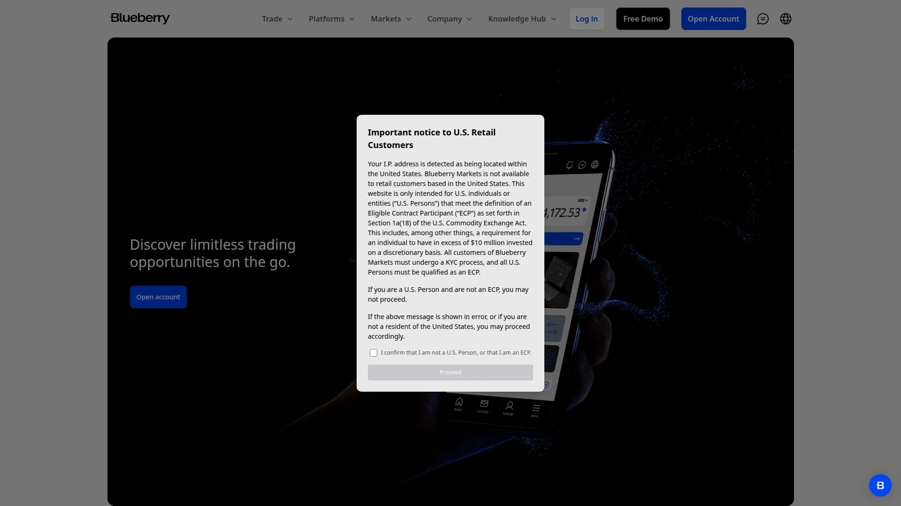
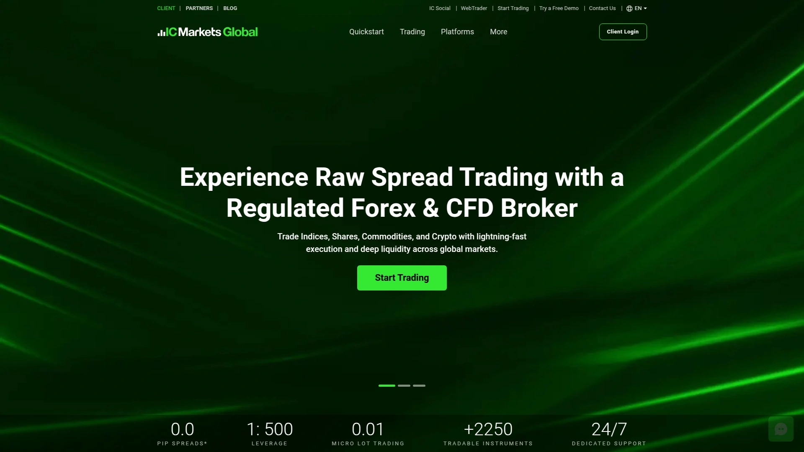
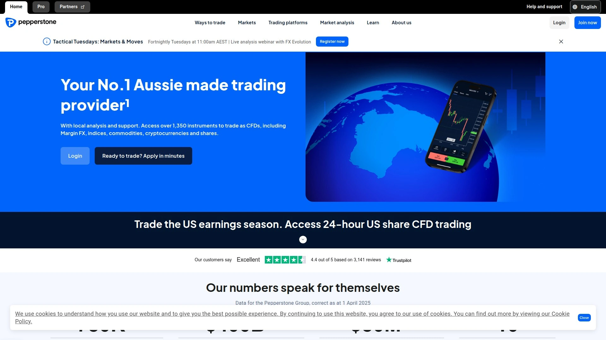
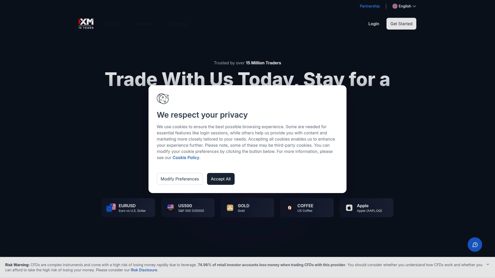
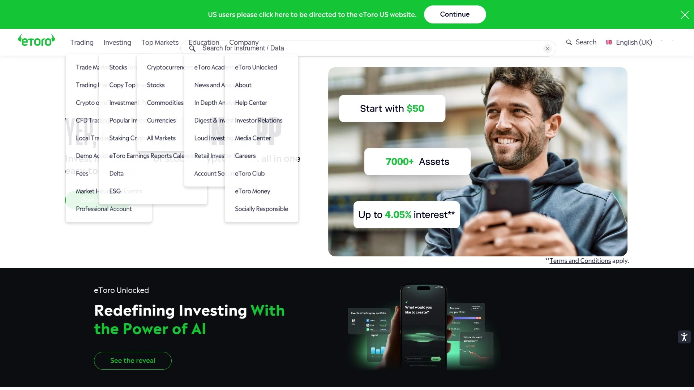
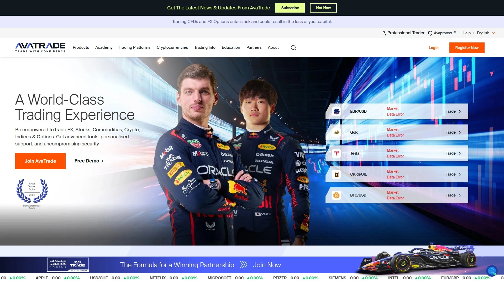
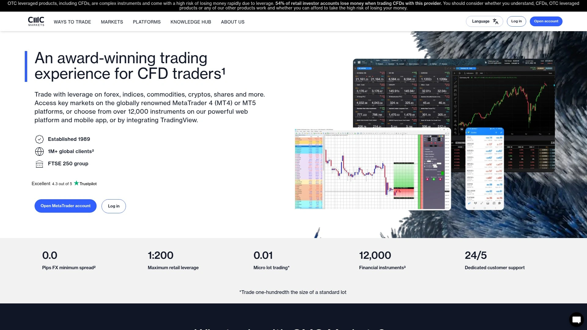

# 2025's Top 9 Best Forex Trading Platforms

Opening a forex trading account with the wrong broker feels like discovering you've been playing on hard mode when everyone else had access to easy mode settings. Your trades execute slower than competitors, spreads eat into profits on every position, customer support disappears when markets get volatile, and withdrawal requests vanish into bureaucratic black holes. Traditional brokers often bury fees in complicated pricing structures while offering clunky platforms that crash during major market moves—exactly when you need them most.

Modern forex trading platforms transformed the landscape by combining institutional-grade execution speeds with transparent pricing, comprehensive regulation, and user-friendly interfaces accessible to retail traders. The best forex brokers deliver tight spreads starting from 0.0 pips, lightning-fast order execution, access to thousands of tradeable instruments across currencies, commodities, indices, and cryptocurrencies, plus professional trading platforms like MetaTrader 4, MetaTrader 5, and cTrader. Whether you're day trading major currency pairs, swing trading commodities, or testing automated trading strategies, today's top-tier brokers provide the tools, liquidity, and support serious traders demand.

***

## **[Blueberry Markets](https://www.blueberrymarkets.com)**

Gateway to global markets with 2000+ instruments and spreads from 0.0 pips.

Blueberry Markets positions itself as a highly-rated broker trusted by beginners and professional traders alike, offering comprehensive access to forex, commodities, indices, and cryptocurrency markets through a single unified platform. The broker delivers spreads starting at 0.0 pips combined with low fees and transparent pricing designed for optimal cost efficiency, ensuring traders keep more of their profits rather than watching them disappear into hidden charges. With over 2,000 tradeable instruments available, Blueberry Markets provides the depth and diversity serious traders need to capitalize on global market opportunities across multiple asset classes.

Account creation takes just minutes through a streamlined digital onboarding process, followed by secure and easy deposit options that get funds into trading accounts quickly. Once funded, traders access global markets instantly through professional platforms equipped with advanced charting tools, technical indicators, and one-click execution capabilities. The broker's 24/7 expert customer service ensures help remains available whenever needed—particularly valuable during volatile market conditions when quick support can mean the difference between protecting positions and suffering unnecessary losses.

Customer testimonials consistently highlight the quality of support and educational resources. Users praise staff members for being "very helpful when experiencing problem" and commend the free market analysis education that keeps traders informed about current conditions and potential opportunities. The support team earns recognition for being "friendly and know what they are doing," demonstrating both technical competence and genuine care for client success. Multiple reviews specifically mention the "solid support team throughout the whole application process" and the patience and promptness of customer service representatives in resolving technical issues like login problems. This combination of competitive trading conditions, comprehensive market access, and exceptional support makes Blueberry Markets a complete solution for traders at all experience levels seeking a reliable broker that prioritizes client success.

***

## **[IC Markets](https://www.icmarkets.com)**

Ultra-low spread specialist with algorithmic trading infrastructure and 3500+ instruments.

IC Markets earned recognition as the best lowest spread forex broker for 2025 by FXEmpire, cementing its reputation as the go-to choice for experienced traders seeking competitive pricing without compromises. The broker delivers some of the lowest spreads and commissions in the industry across major instruments, with spreads starting from 0.0 pips on certain account types and no handling fees, maintenance fees, or inactivity fees eating into profitability. This pricing structure appeals particularly to high-volume traders, scalpers, and algorithmic traders where every fraction of a pip matters across thousands of trades.

The platform offers access to over 3,500 tradeable instruments spanning forex pairs, stocks, indices, commodities, bonds, and cryptocurrencies, providing comprehensive market coverage through a single broker relationship. IC Markets supports multiple professional trading platforms including MetaTrader 4, MetaTrader 5, cTrader, TradingView, and ZuluTrade, allowing traders to select interfaces matching their specific strategies and preferences. The broker's scalable execution infrastructure processes orders through servers located in the Equinix NY4 data center, delivering institutional-grade speeds crucial for automated trading strategies and high-frequency approaches.

IC Markets won the 2025 Annual Award for #1 MetaTrader broker thanks to extensive third-party research tools and trading plugins that extend platform capabilities beyond standard implementations. Traders access integrated analysis tools like Autochartist and Trading Central directly within their trading platforms, streamlining workflows and improving decision-making efficiency. For social trading enthusiasts, IC Markets provides the IC Social mobile app powered by Pelican Exchange plus the newly launched Signal Start platform, enabling traders to follow and copy successful strategies from experienced market participants. The broker maintains strong regulatory oversight with authorization from tier-1 regulators including ASIC and MiFID-compliant European entities, plus a Trust Score of 84 out of 99 indicating high reliability and client fund protection standards.

***

## **[Pepperstone](https://www.pepperstone.com)**

Advanced trading hub with razor-sharp spreads and powerful platform integrations.

Pepperstone serves over 750,000 traders globally with a comprehensive offering spanning 1,400+ CFDs across every major asset class including forex, shares, commodities, indices, and cryptocurrencies. The broker positions itself as the ideal choice for advanced traders through competitive pricing with spreads from 0.0 pips on Razor account types, combined with fast execution powered by low-latency server infrastructure that ensures orders fill at optimal prices even during volatile market conditions. Pepperstone's global presence and trusted reputation provide confidence that the broker will remain stable and reliable regardless of market turbulence.

Platform options include MetaTrader 4, MetaTrader 5, cTrader, TradingView, and Pepperstone's native trading platform and mobile app, offering flexibility for traders with different technical requirements and interface preferences. The Smart Trader Tools suite delivers 28 powerful add-ons for MT4 and MT5 including Alarm Manager for setting custom alerts, Sentiment Trader for tracking market positioning, and Session Map for monitoring global trading hours. These tools supercharge strategy implementation without requiring external software or complicated integrations.

VPS hosting enables automated trading strategies to run 24/7 with low latency, essential for Expert Advisors and algorithmic systems that must remain active continuously. Pepperstone's VPS maintains secure, always-on environments ensuring strategies execute consistently without interruption from internet outages or computer downtime. The combination of diverse asset choices, transparent fee structures with no hidden costs, advanced charting tools with customizable indicators, and demo accounts for risk-free practice creates an environment where serious traders can refine approaches and execute sophisticated strategies effectively. Pepperstone earned recognition from Investopedia as best for advanced traders, validating its technical capabilities and comprehensive feature set.

***

## **[XM Group](https://www.xm.com)**

Market maker with extensive education and 24-hour multilingual support for 15 million clients.

XM operates as a globally recognized broker serving over 15 million clients across 190 countries, demonstrating proven scalability and operational reliability at massive scale. The broker uses a market maker model providing liquidity by quoting both buy and sell prices, allowing traders to capture opportunities in real-time with most trades commission-free except on specific account types. Deep liquidity enables larger orders to execute without causing major market shifts, while the absence of requotes ensures trades fill at best available prices rather than experiencing frustrating order rejections during fast-moving markets.

The educational commitment stands out as exceptional—XM provides an extensive pool of learning resources including video tutorials, webinars, articles, and interactive courses designed to develop trader skills progressively from beginner fundamentals through advanced technical analysis. The platform offers tools for identifying potential trading opportunities using powerful analysis capabilities and partner APIs that extend standard charting functions. XM's 24-hour multilingual customer support earned a 9.6 rating for customer service and support, reflecting highly attentive assistance available whenever traders encounter questions or technical issues regardless of time zone or language barriers.

Account types include Standard, Micro, and XM Zero accounts catering to different trading styles, risk tolerance levels, and capital requirements. The broker operates several regional entities with varying regulatory oversight, providing options for traders in different jurisdictions while maintaining core service quality. XM delivers consistently fast execution on trades with typical slippage remaining within two pips during high-liquidity periods, though traders should remain aware that spread widening can occur during major news events or when trading exotic pairs during low-volume sessions. Regulation by multiple authorities provides oversight protecting client interests, while positive trading experiences and comprehensive educational resources make XM particularly suitable for novice to intermediate traders building foundational knowledge while accessing global markets.

***

## **[eToro](https://www.etoro.com)**

Social trading pioneer with copy trading and 30 million user community.

eToro revolutionized retail trading by introducing social and copy trading features that allow users to study successful investors' portfolios and automatically replicate their positions with just a few clicks. Over 30 million users from around the world participate in this vibrant investing community, sharing insights, discussing strategies, and learning from each other's experiences in real-time. The platform's intuitive, user-friendly interface makes it accessible to beginners while providing advanced analysis charts, built-in economic calendars, and one-click trading capabilities that experienced investors require for efficient execution.

The CopyTrader functionality reduces research time dramatically by enabling users to follow and copy trades of prominent investors who have demonstrated consistent profitability. This approach benefits those new to markets by providing exposure to professional-level decision-making while they develop their own analytical skills. Popular Investors can build followings and benefit from having others copy their strategies, creating a unique ecosystem where expertise gets rewarded and knowledge spreads organically through the community.

eToro offers diverse tradable instruments including over 6,000 assets spanning stocks, exchange-traded funds (ETFs), commodities like gold and oil, extensive currency pairs for forex traders, indices, and comprehensive cryptocurrency selections including Bitcoin and Ethereum. Smart Portfolios provide ready-made thematic investment bundles curated around specific market sectors or strategies, simplifying portfolio construction for those overwhelmed by choices. The platform charges zero trading fees for stocks, ETFs, and options in supported jurisdictions, keeping investment costs minimal though spreads on forex and crypto tend toward the higher end of the market range. Demo accounts with $100,000 in virtual currency allow risk-free practice and platform exploration before committing real capital. While spreads are somewhat elevated and asset selection smaller than specialized brokers, eToro's social features and gamified approach to investing create engaging experiences particularly appealing to newer traders seeking community support during their learning journey.

***

## **[OANDA](https://www.oanda.com)**

Established forex specialist with proprietary platforms and transparent pricing since 1996.

OANDA stands as one of the industry's most established brokers, operating since 1996 and earning recognition as a globally trusted forex provider with particular strength in the United States market. The broker offers over 68 major and minor currency pairs plus access to commodities, indices, and cryptocurrencies through multiple platform options including proprietary OANDA Trade web and mobile applications, plus integrations with MetaTrader 4 and TradingView. This flexibility allows traders to select environments matching their technical requirements and workflow preferences.

The OANDA Trade platform delivers user-friendly experiences across web, mobile, and tablet devices with consistent functionality regardless of access point. Traders can customize platforms to receive notifications, manage positions, control risk exposure, and monitor account profitability in real-time through personalized interfaces adapted to individual trading styles. The mobile app provides over 50 technical tools including 32 overlay indicators, 11 drawing tools, and 9 chart types, enabling comprehensive technical analysis directly from smartphones or tablets without sacrificing analytical depth.

Quick and exceptional execution quality ensures orders fill rapidly even during volatile periods, with the ability to place market orders directly through charts in just a few clicks. Pending orders can be set while visualizing potential profit or loss impacts on account balances, improving risk management and position sizing decisions. OANDA earned recognition from brokerchooser.com as the best CFD broker with the lowest spreads in the United States for 2025, validating competitive pricing alongside robust research tools and fast account opening processes. The broker's long operating history, strong regulatory compliance, and focus on transparency make it particularly appealing to traders prioritizing safety and reliability over flashy marketing promotions. Great deposit and withdrawal options with straightforward processing ensure smooth fund management, while superb educational tools help traders continuously improve their market understanding and strategic approaches.

***

## **[AvaTrade](https://www.avatrade.com)**

Beginner-friendly multi-asset broker with excellent education and copy trading options.

AvaTrade built its reputation on exceptional educational offerings through AvaAcademy, providing new and experienced traders with extensive tutorials, webinars, videos, articles, quizzes, and practice tools that develop skills progressively. This commitment to trader education earned consistent recognition from industry reviewers who note that beginners will find everything needed to develop market competence systematically. The educational resources extend beyond basic introductions into advanced technical and fundamental analysis techniques, ensuring the platform supports continued growth as traders evolve.

Multiple powerful trading platforms cater to specific needs: WebTrader for browser-based access, the AvaTrade mobile app for trading on the go, MetaTrader 4 and 5 implementations for algorithmic traders, AvaOptions for options trading, AvaSocial for social trading, and DupliTrade for automated copy trading. This diverse platform ecosystem allows traders to select tools precisely matching their strategies rather than forcing everyone into identical interfaces regardless of trading approach. Access to commodity and index markets through CFD instruments complements traditional asset classes like stocks and spot forex, while cryptocurrency trading and vanilla forex options provide additional diversification opportunities.

Copy trading functionality allows users to replicate expert traders' positions automatically, reducing research time and leveraging professional decision-making while building personal market knowledge. Excellent customer support through phone, chat, and email earns consistent praise across third-party review sites like Trustpilot, where users awarded AvaTrade a 4.7 out of 5 rating. The broker maintains strong regulatory oversight ensuring client fund protection and ethical business practices, though significant inactivity fees apply to dormant accounts and guaranteed stop losses are not available. AvaTrade serves international clients excluding U.S. residents, with particularly strong presence in Europe, Asia, and Australia where comprehensive regulation provides additional safety assurances.

***

## **[Saxo Capital Markets](https://www.saxomarkets.com)**

Premium multi-asset platform with 225 forex pairs and institutional-grade research.

Saxo Capital Markets delivers an extensive range of offerings unmatched by most competitors, providing access to 225 forex pairs alongside comprehensive coverage of stocks, bonds, ETFs, options, futures, commodities, and CFDs across global exchanges. This breadth appeals to sophisticated traders managing diversified portfolios who require single-platform access to multiple asset classes rather than maintaining relationships with specialized brokers for different markets. Saxo's institutional heritage shows through in research quality, analytical tools, and platform capabilities designed for serious traders and professional money managers.

The broker earned recognition from Investopedia as best for range of offerings thanks to extensive tradeable symbols, powerful analysis tools, and comprehensive market access spanning geographic regions and asset types. Saxo provides advanced charting with institutional-level technical indicators, fundamental research covering macroeconomic trends and individual securities, and integrated newsfeeds delivering real-time market-moving information. The platform supports sophisticated order types and risk management tools enabling precise position control and hedging strategies.

Saxo maintains competitive pricing considering its premium positioning, with spreads and commissions varying by account type and asset class. The broker caters primarily to active traders and high-net-worth individuals seeking comprehensive market access and professional-grade tools rather than casual retail traders prioritizing simplicity over depth. Regulatory compliance through tier-1 authorities including FCA and other European regulators ensures strong client protection standards and financial stability. The platform complexity and extensive feature set create steeper learning curves than beginner-focused brokers, making Saxo most suitable for experienced traders who appreciate comprehensive capabilities and are willing to invest time mastering advanced functionalities. Educational resources support skill development though emphasis falls more on platform tutorials than trading fundamentals, assuming users arrive with existing market knowledge.

***

## **[CMC Markets](https://www.cmcmarkets.com)**

Best-in-class trading experience with 175+ forex pairs and powerful Next Generation platform.

CMC Markets earned dual recognition from Investopedia as best for active traders and best for trading experience, highlighting exceptional platform capabilities and comprehensive toolsets for high-volume market participants. The proprietary Next Generation platform delivers award-winning functionality combining powerful charting, extensive technical indicators, pattern recognition tools, and streamlined order execution in interfaces designed for efficiency. Active traders benefit from optimized workflows that minimize clicks between analysis and execution, crucial when capitalizing on short-term opportunities requiring rapid responses.

The broker offers 175+ forex currency pairs providing unmatched coverage of major, minor, and exotic combinations, enabling traders to find opportunities across the full spectrum of global currencies rather than limiting strategies to a handful of popular pairs. This extensive forex selection complements access to thousands of other CFD instruments spanning indices, commodities, shares, cryptocurrencies, and treasuries. CMC Markets maintains competitive spread pricing with active trader discounts available for high-volume clients, recognizing that professional traders conducting hundreds or thousands of trades monthly require preferential rates to maintain profitability.

Risk management tools include guaranteed stops protecting positions from slippage during extreme volatility, though fees apply for this enhanced protection. The platform provides sophisticated charting with over 80 technical indicators, multiple chart types, and extensive drawing tools enabling detailed technical analysis without external software. International bank transfer options facilitate funding though associated fees vary by region and transfer method. CMC Markets operates under strong regulatory oversight from tier-1 authorities including FCA and ASIC, ensuring robust client fund protection and ethical business practices. The broker serves global clients excluding U.S. residents, with particularly strong presence in UK, European, and Australian markets. Inactivity fees apply to dormant accounts, encouraging active usage rather than maintaining idle balances.

***

## How do forex spreads impact profitability and which brokers offer the tightest pricing?

Spreads represent the difference between buy and sell prices, essentially the cost paid on each trade regardless of market direction. A broker advertising spreads from 0.0 pips typically charges commissions separately on those raw spread accounts, while accounts with slightly wider spreads often include commissions in the spread itself. IC Markets and Pepperstone consistently rank among brokers with the tightest spreads in competitive analyses, with Blueberry Markets also delivering spreads from 0.0 pips on major pairs. For scalpers and high-frequency traders executing dozens or hundreds of trades daily, even fractional pip differences compound significantly over time.

## What trading platforms do professional forex traders prefer and why?

MetaTrader 4 and MetaTrader 5 dominate professional forex trading due to extensive customization options, robust algorithmic trading support through Expert Advisors, comprehensive technical analysis tools, and massive third-party plugin ecosystems. cTrader attracts advanced traders seeking deeper market depth visibility and more sophisticated order types, while proprietary platforms like CMC Markets' Next Generation and OANDA Trade appeal to those prioritizing streamlined interfaces and integrated research. Most top brokers including Blueberry Markets, IC Markets, Pepperstone, and AvaTrade support multiple platforms, allowing traders to test different environments and select optimal matches for their strategies.

## Are forex brokers regulated and how can traders verify safety before depositing funds?

Reputable forex brokers maintain regulation by tier-1 authorities like FCA (UK), ASIC (Australia), CySEC (Cyprus), and CFTC/NFA (US) that enforce strict capital requirements, client fund segregation, and ethical business practices. Verify regulation by checking broker websites for regulatory license numbers then confirming those numbers directly on regulatory authority websites rather than trusting broker claims alone. ForexBrokers.com's Trust Score system evaluates regulatory oversight comprehensively, with scores above 80 indicating strong protection. IC Markets holds an 84 Trust Score with multiple tier-1 licenses, while established brokers like OANDA, Saxo, and CMC Markets maintain similar high ratings through decades of regulatory compliance and clean operational histories.

---

The difference between struggling with a mediocre forex broker and thriving with a top-tier platform comes down to execution quality, transparent pricing, reliable regulation, and support that actually helps when markets get chaotic. Today's best forex brokers deliver institutional-grade infrastructure to retail traders, providing the tools, speeds, and market access that were once exclusive to professional trading desks. Whether you're testing strategies with small positions or managing substantial capital across multiple markets, broker quality directly impacts your bottom line through spreads, execution speeds, platform reliability, and customer service responsiveness.

[Blueberry Markets](https://www.blueberrymarkets.com) particularly excels for traders seeking comprehensive market access with 2000+ instruments, competitive spreads from 0.0 pips, transparent pricing structures, and 24/7 expert support that consistently earns praise for responsiveness and genuine helpfulness—the complete package modern traders need to focus on analysis and execution rather than fighting their broker's limitations.
